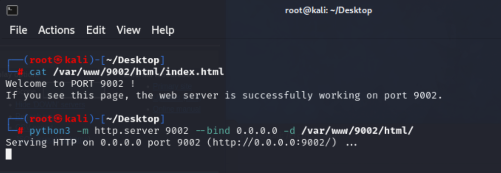
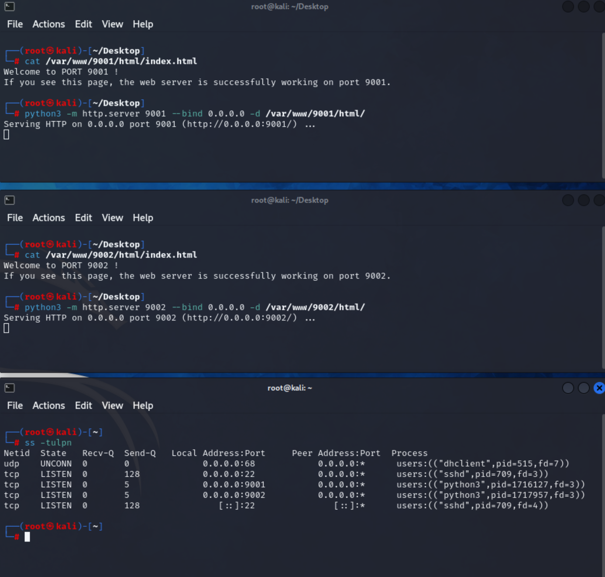
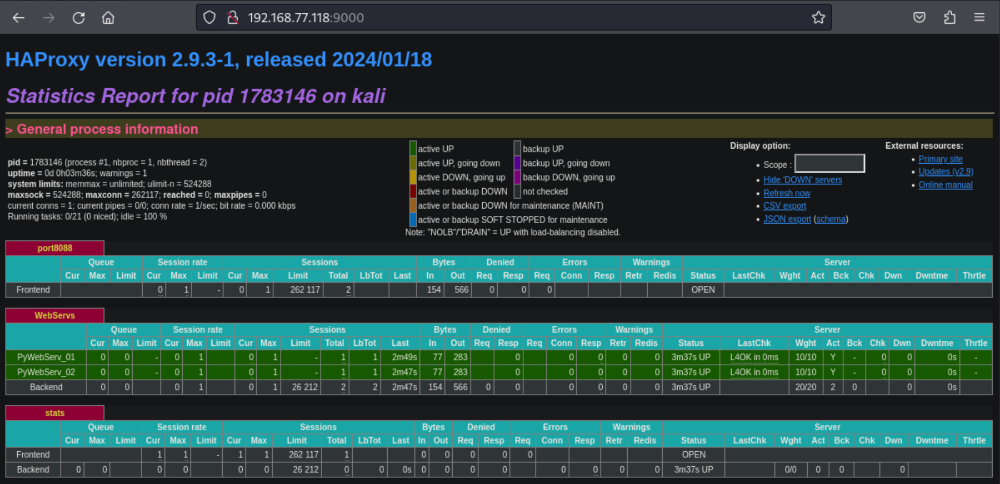
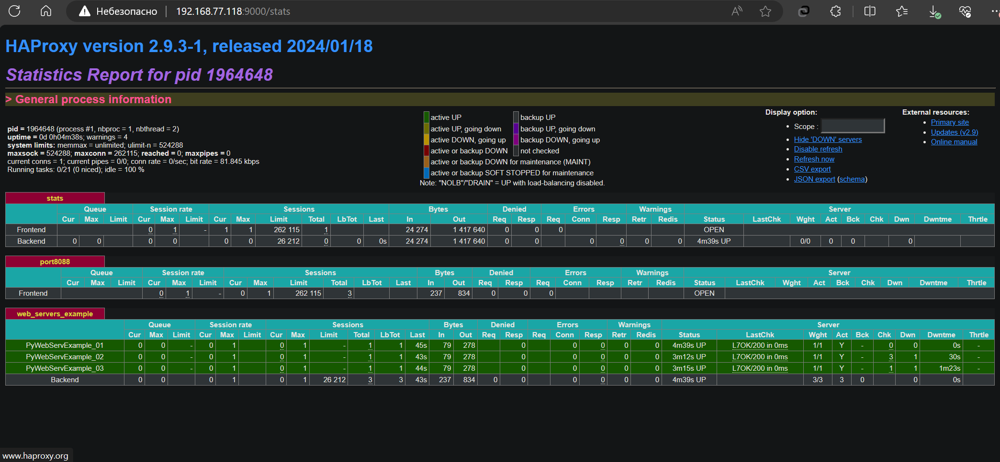
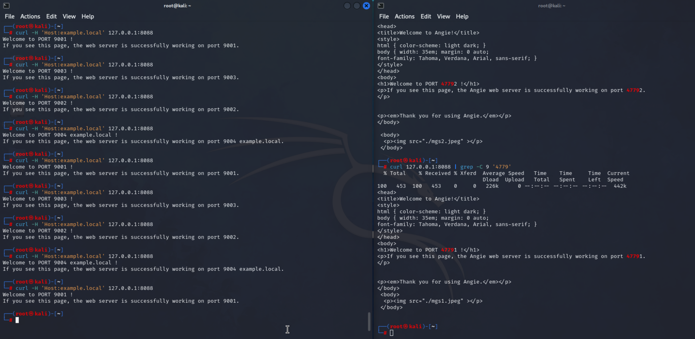

# Домашнее задание к занятию 2 «Кластеризация и балансировка нагрузки»

### Цель задания
В результате выполнения этого задания вы научитесь:
1. Настраивать балансировку с помощью HAProxy
2. Настраивать связку HAProxy + Nginx

------

### Чеклист готовности к домашнему заданию

1. Установлена операционная система Ubuntu на виртуальную машину и имеется доступ к терминалу
2. Просмотрены конфигурационные файлы, рассматриваемые на лекции, которые находятся по [ссылке](2/)


------
<!--

### Инструкция по выполнению домашнего задания

1. Сделайте fork [репозитория c шаблоном решения](https://github.com/netology-code/sys-pattern-homework) к себе в Github и переименуйте его по названию или номеру занятия, например, https://github.com/имя-вашего-репозитория/gitlab-hw или https://github.com/имя-вашего-репозитория/8-03-hw).
2. Выполните клонирование этого репозитория к себе на ПК с помощью команды git clone.
3. Выполните домашнее задание и заполните у себя локально этот файл README.md:
   - впишите вверху название занятия и ваши фамилию и имя;
   - в каждом задании добавьте решение в требуемом виде: текст/код/скриншоты/ссылка;
   - для корректного добавления скриншотов воспользуйтесь инструкцией [«Как вставить скриншот в шаблон с решением»](https://github.com/netology-code/sys-pattern-homework/blob/main/screen-instruction.md);
   - при оформлении используйте возможности языка разметки md. Коротко об этом можно посмотреть в [инструкции по MarkDown](https://github.com/netology-code/sys-pattern-homework/blob/main/md-instruction.md).
4. После завершения работы над домашним заданием сделайте коммит (git commit -m "comment") и отправьте его на Github (git push origin).
5. Для проверки домашнего задания преподавателем в личном кабинете прикрепите и отправьте ссылку на решение в виде md-файла в вашем Github.
6. Любые вопросы задавайте в чате учебной группы и/или в разделе «Вопросы по заданию» в личном кабинете.

-->

------


### Задание 1
- Запустите два simple python сервера на своей виртуальной машине на разных портах
- Установите и настройте HAProxy, воспользуйтесь материалами к лекции по [ссылке](2/)
- Настройте балансировку Round-robin на 4 уровне.
- На проверку направьте конфигурационный файл haproxy, скриншоты, где видно перенаправление запросов на разные серверы при обращении к HAProxy.


Выполнение задания

В качестве стенда будем использовать ВМ с установленной ОС Kali Linux, под учетной записью root

Подготовка web серверов с помощью Python'а

1 сервер, с index.html в каталоге /var/www/9001

  порт обращения к серверу - 9001

Содержимое index.html

```
Welcome to PORT 9001 !
If you see this page, the web server is successfully working on port 9001.
```
команда запуска веб-сервера

```
  python3 -m http.server 9001 --bind 0.0.0.0 -d /var/www/9001/html/
```


2 сервер, с index.html в каталоге /var/www/9002

  порт обращения к серверу - 9002

Содержимое index.html

```
Welcome to PORT 9002 !
If you see this page, the web server is successfully working on port 9002.
```
команда запуска веб-сервера

```
  python3 -m http.server 9002 --bind 0.0.0.0 -d /var/www/9002/html/
```




убедимся, что наши серверы отвечают на своих портах

```
ss -tulpn
```



а также сделаем обращение с помощью **_curl_** на соответствующие порты по локальному адресу _lo_ и адресу внешнего интерфейса _eth0_

```
curl 127.0.0.1:9001

curl 192.168.77.118:9001
```


ВМ готова.

Устанавливаем **HAproxy** c конфигурацией [haproxy config](./2/haproxy/haproxy.cfg)

```
 sudo apt-get install haproxy
 
 sudo nano /etc/haproxy/haproxy.cfg
  
```

в секции frontend указываем имя хоста, например, _wserv.py_

```
frontend myweb  # секция фронтенд
        mode tcp
        bind :3306
        acl ACL_wserv.py hdr(host) -i wserv.py
        use_backend web_servers if ACL_wserv.py

```

Конфигурация haproxy для балансировки по методу Round-robin на 4 уровне.

```
backend web_servers    # секция бэкенд
        mode tcp
        balance roundrobin
        server PyWebServ_01 127.0.0.1:9001 check
        server PyWebServ_02 127.0.0.1:9002 check

```

После внесения изменений в файл конфига _haproxy.cfg_ незабываем перезапустить службу, или перечитать конфиг командой _reload_

```
systemctl restart haproxy.service

systemctl reload haproxy.service
```

проверка :


Статистика по обращениям через HAproxy



Конфигурационный файл [**_haproxy.cfg_**](./2/haproxy_1/haproxy.cfg)

---


### Задание 2
- Запустите три simple python сервера на своей виртуальной машине на разных портах
- Настройте балансировку Weighted Round Robin на 7 уровне, чтобы первый сервер имел вес 2, второй - 3, а третий - 4
- HAproxy должен балансировать только тот http-трафик, который адресован домену example.local
- На проверку направьте конфигурационный файл haproxy, скриншоты, где видно перенаправление запросов на разные серверы при обращении к HAProxy c использованием домена example.local и без него.


---

### Выполнения задания 2

запустим три сервера : 

Server1 порт: 9001

Server1 порт: 9002

Server1 порт: 9003


в настройках HAproxy перенастроим  fronted и backend:

для домена "example.local"

```
frontend example # секция фронтенд
        bind :8088
        acl ACL_example.local hdr(host) -i example.local
        use_backend web_servers_example if ACL_example.local
```

В секции backend добавим 3ий сервер и настроим веса для каждого сервера

```
backend web_servers_example    # секция бэкенд
        mode http
        balance roundrobin
        option httpchk
        http-check send meth GET uri /index.html
        server PyWebServ2_01 127.0.0.1:9001 check weight 2
        server PyWebServ2_02 127.0.0.1:9002 check weight 3
        server PyWebServ2_03 127.0.0.1:9003 check weight 4
```


# _HAproxy Statistics_




Конфигурация HAProxy 
[**_haproxy.cfg_**](./2/haproxy_2/haproxy.cfg)


прверяем: все три сервера участвуют в балансировке


---


## Задания со звёздочкой*
Эти задания дополнительные. Их можно не выполнять. На зачёт это не повлияет. Вы можете их выполнить, если хотите глубже разобраться в материале.

---

### Задание 3*
- Настройте связку HAProxy + Nginx как было показано на лекции.
- Настройте Nginx так, чтобы файлы .jpg выдавались самим Nginx (предварительно разместите несколько тестовых картинок в директории /var/www/), а остальные запросы переадресовывались на HAProxy, который в свою очередь переадресовывал их на два Simple Python server.
- На проверку направьте конфигурационные файлы nginx, HAProxy, скриншоты с запросами jpg картинок и других файлов на Simple Python Server, демонстрирующие корректную настройку.

Вместо NGinx'а используем форк - Angie

Установка сервера Angie согласно документации с [оф.сайта](https://angie.software/install/#)

создаем пару сайтов на разных портах:

порт 47791

конфиг [47791.conf](./2/angie/47791.conf)

[index.html](./2/angie/47791/html/index.html)

[каталог html](./2/angie/47791/html/)  

порт 47792

конфиг [47792.conf](./2/angie/47792.conf)

[index.html](./2/angie/47792/html/index.html)

[каталог html](./2/angie/47792/html/)


Настройка _haproxy_ совмещена с 4 заданием:

---

### Задание 4*
- Запустите 4 simple python сервера на разных портах.
- Первые два сервера будут выдавать страницу index.html вашего сайта example1.local (в файле index.html напишите example1.local)
- Вторые два сервера будут выдавать страницу index.html вашего сайта example2.local (в файле index.html напишите example2.local)
- Настройте два бэкенда HAProxy
- Настройте фронтенд HAProxy так, чтобы в зависимости от запрашиваемого сайта example1.local или example2.local запросы перенаправлялись на разные бэкенды HAProxy
- На проверку направьте конфигурационный файл HAProxy, скриншоты, демонстрирующие запросы к разным фронтендам и ответам от разных бэкендов.

[haproxy.cfg](./2/haproxy_3/haproxy.cfg)




------

### Правила приема работы

1. Необходимо следовать инструкции по выполнению домашнего задания, используя для оформления репозиторий Github
2. В ответе необходимо прикладывать требуемые материалы - скриншоты, конфигурационные файлы, скрипты. Необходимые материалы для получения зачета указаны в каждом задании.


------

### Критерии оценки

- Зачет - выполнены все задания, ответы даны в развернутой форме, приложены требуемые скриншоты, конфигурационные файлы, скрипты. В выполненных заданиях нет противоречий и нарушения логики
- На доработку - задание выполнено частично или не выполнено, в логике выполнения заданий есть противоречия, существенные недостатки, приложены не все требуемые материалы.
