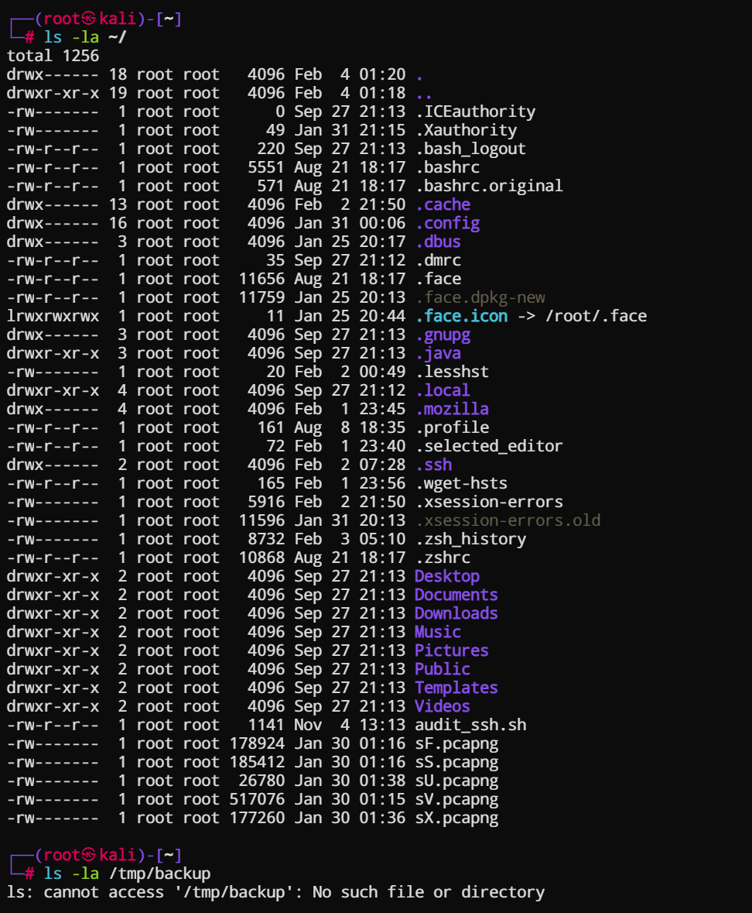
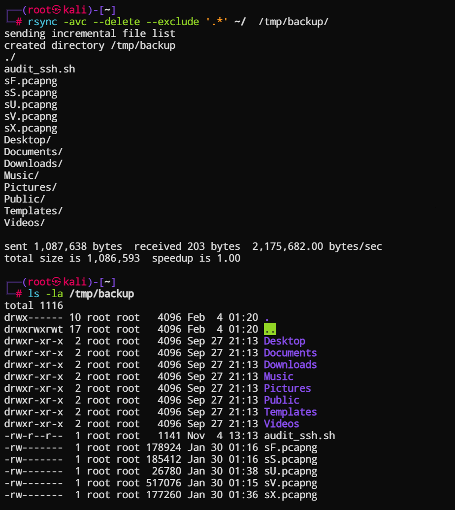
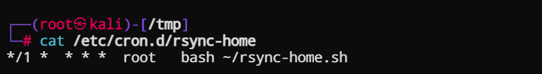
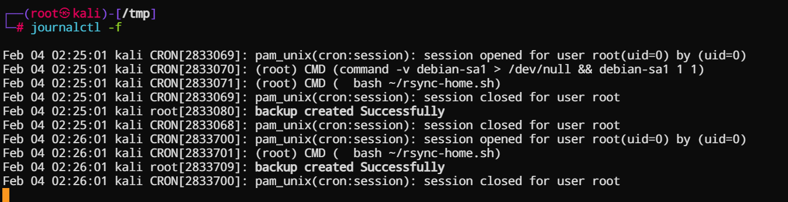
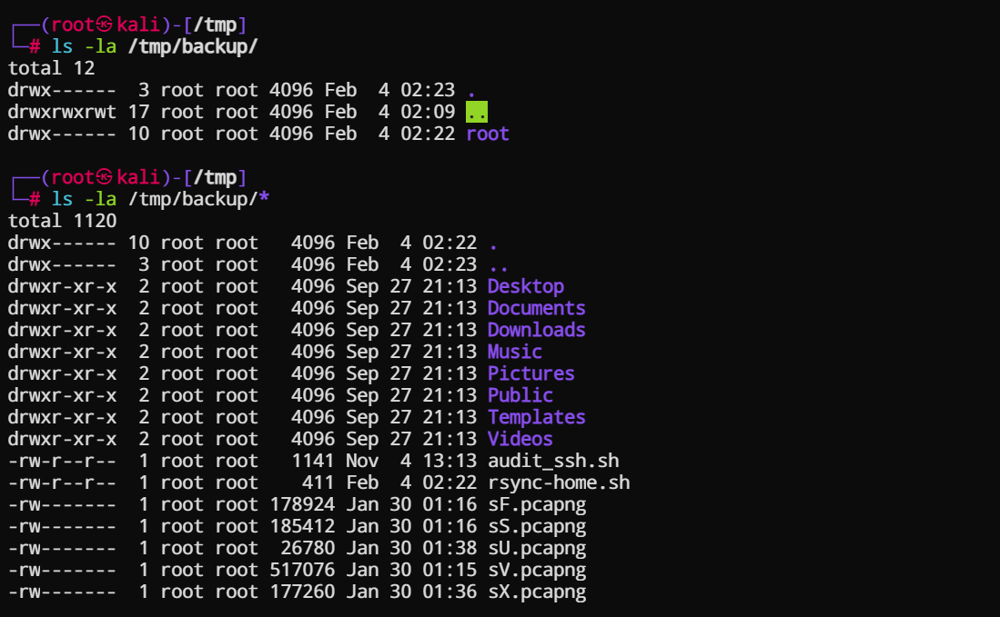

# Домашнее задание к занятию 3 «Резервное копирование»

### Цель задания
В результате выполнения этого задания вы научитесь:
1. Настраивать регулярные задачи на резервное копирование (полная зеркальная копия)
2. Настраивать инкрементное резервное копирование с помощью rsync

------

### Чеклист готовности к домашнему заданию

1. Установлена операционная система Ubuntu на виртуальную машину и имеется доступ к терминалу
2. Сделан клон этой виртуальной машины с другим IP адресом

<!--

------

### Инструкция по выполнению домашнего задания

1. Сделайте fork [репозитория c шаблоном решения](https://github.com/netology-code/sys-pattern-homework) к себе в Github и переименуйте его по названию или номеру занятия, например, https://github.com/имя-вашего-репозитория/gitlab-hw или https://github.com/имя-вашего-репозитория/8-03-hw).
2. Выполните клонирование этого репозитория к себе на ПК с помощью команды git clone.
3. Выполните домашнее задание и заполните у себя локально этот файл README.md:
   - впишите вверху название занятия и ваши фамилию и имя;
   - в каждом задании добавьте решение в требуемом виде: текст/код/скриншоты/ссылка;
   - для корректного добавления скриншотов воспользуйтесь инструкцией [«Как вставить скриншот в шаблон с решением»](https://github.com/netology-code/sys-pattern-homework/blob/main/screen-instruction.md);
   - при оформлении используйте возможности языка разметки md. Коротко об этом можно посмотреть в [инструкции по MarkDown](https://github.com/netology-code/sys-pattern-homework/blob/main/md-instruction.md).
4. После завершения работы над домашним заданием сделайте коммит (git commit -m "comment") и отправьте его на Github (git push origin).
5. Для проверки домашнего задания преподавателем в личном кабинете прикрепите и отправьте ссылку на решение в виде md-файла в вашем Github.
6. Любые вопросы задавайте в чате учебной группы и/или в разделе «Вопросы по заданию» в личном кабинете.

-->

------


### Задание 1
- Составьте команду rsync, которая позволяет создавать зеркальную копию домашней директории пользователя в директорию `/tmp/backup`
- Необходимо исключить из синхронизации все директории, начинающиеся с точки (скрытые)
- Необходимо сделать так, чтобы rsync подсчитывал хэш-суммы для всех файлов, даже если их время модификации и размер идентичны в источнике и приемнике.
- На проверку направить скриншот с командой и результатом ее выполнения


### Выполнение задания 1

Синтаксис Rsync

```
rsync -options <source> <destination>
```

[памятка по ключам утилиты rsync](./3/rsync-help.txt)

Выполним резервное копировани каталога пользователя _user_ в /tmp/backup/ :

```
 rsync -avc --delete --exclude '.*' /home/user/ /tmp/backup/

```
или, для текущего пользователя вошедшего в систему:

```
rsync -avc --delete --exclude '.*' ~/  /tmp/backup/
```

где, 
```
  -a, --archive – архивный режим, включает рекурсивное копирование и сохранение прав и владельца
  -v, --verbose – вывести подробную информацию о процессе
  -c, --checksum – использование сверки по контрольным суммам, а не по времени изменения и размеру файлов.
  --delete – удалять файлы, которых нет в источнике
  --exclude – исключить файлы
```

домашняя директория пользователя, и проверка каталога **_/tmp/backup_** - каталог отсутствует. 



запуск утилиты **_rsync_** и вывод содержимого целевого каталога **_/tmp/backup_**



### Задание 2
- Написать скрипт и настроить задачу на регулярное резервное копирование домашней директории пользователя с помощью rsync и cron.
- Резервная копия должна быть полностью зеркальной
- Резервная копия должна создаваться раз в день, в системном логе должна появляться запись об успешном или неуспешном выполнении операции
- Резервная копия размещается локально, в директории `/tmp/backup`
- На проверку направить файл crontab и скриншот с результатом работы утилиты.


### Выполнения задания 2


Резервное копирование домашней директории 

```
rsync -avc --delete --exclude '.*' ~/  /tmp/backup/

```

создаем скрипт ~/rsync-home.sh и выполняем по расписанию каждый день 

Настройки расписания можно делать через **_crontab_**, но мы будем делать в виде отдельного файла с заданием и поместим его в каталог **_/etc/cron.d/_**

Так, или иначе, строка для выполнения задания выглядит идентично: 

```
*/1  *   * * *  root   bash ~/rsync-home.sh
```



Скрипт проверяет вывод rsync, и записывает информацию в системный журнал

```
#!/bin/bash

source=$HOME 
dest='/tmp/backup/'

rsync_sending=$(rsync -avc --delete --exclude '.*' $source $dest  2>&1 | sed  '/^#\|^$\| *#/d' | awk 'NR==1 {print $1}')

if [ -d "$dest" ]; then
        if [ $rsync_sending == "sending" ] ; then
                logger "backup created Successfully";
        else
                logger "backup no create";
        fi
else
        logger "backup dir not found";
fi

```

Проверим по журналу выполнения команды по рассписанию:

```
journalctl -f
```



Результат выполения



----


---

## Задания со звёздочкой*
Эти задания дополнительные. Их можно не выполнять. На зачёт это не повлияет. Вы можете их выполнить, если хотите глубже разобраться в материале.

---

### Задание 3*
- Настройте ограничение на используемую пропускную способность rsync до 1 Мбит/c
- Проверьте настройку, синхронизируя большой файл между двумя серверами
- На проверку направьте команду и результат ее выполнения в виде скриншота


### Задание 4*
- Напишите скрипт, который будет производить инкрементное резервное копирование домашней директории пользователя с помощью rsync на другой сервер
- Скрипт должен удалять старые резервные копии (сохранять только последние 5 штук)
- Напишите скрипт управления резервными копиями, в нем можно выбрать резервную копию и данные восстановятся к состоянию на момент создания данной резервной копии.
- На проверку направьте скрипт и скриншоты, демонстрирующие его работу в различных сценариях.

------

### Правила приема работы

1. Необходимо следовать инструкции по выполнению домашнего задания, используя для оформления репозиторий Github
2. В ответе необходимо прикладывать требуемые материалы - скриншоты, конфигурационные файлы, скрипты. Необходимые материалы для получения зачета указаны в каждом задании.


------

### Критерии оценки

- Зачет - выполнены все задания, ответы даны в развернутой форме, приложены требуемые скриншоты, конфигурационные файлы, скрипты. В выполненных заданиях нет противоречий и нарушения логики
- На доработку - задание выполнено частично или не выполнено, в логике выполнения заданий есть противоречия, существенные недостатки, приложены не все требуемые материалы.


